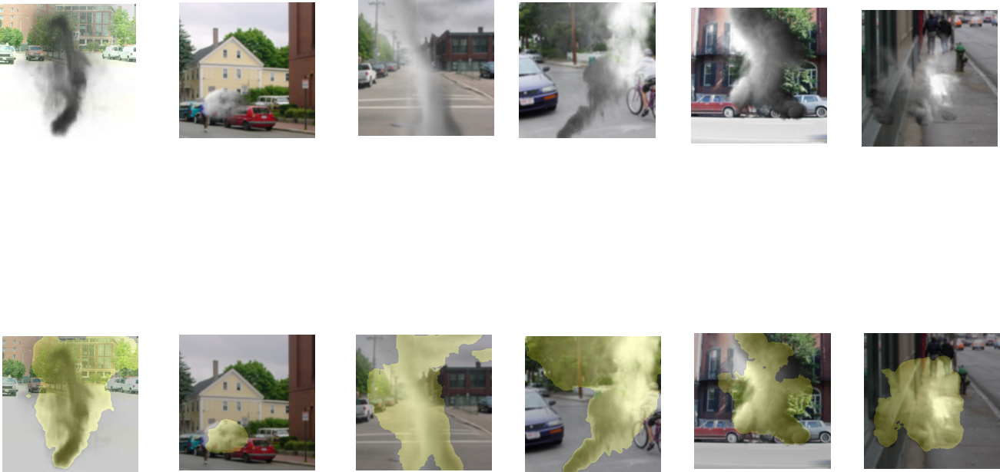

# smoke-segmentation
PyTorch implementation of Deep Smoke Segementation
this is a implement of [Deep smoke segmentation](https://arxiv.org/abs/1809.00774)
## Overview
### Data
[train data](https://pan.baidu.com/share/init?surl=B_KC7SBKiQOPgPk8SWgZhg) with password “w5nv”,test data: [DS01](https://pan.baidu.com/share/init?surl=auG5E6vY2WNlkoWVovZ8Sw) with password "bymb", [DS02](https://pan.baidu.com/share/init?surl=pMQgPcBWBzPd_hck6CAbVA) with password "0s0d", [DS03](https://pan.baidu.com/share/init?surl=tQ00gqlXBhSi9F59LQr-Jg) with password "n8w4";
### model 
you can run the test using [model](https://pan.baidu.com/s/16IolEoXFZChlTKNo2t5jnA) with password "3d7c"

## How to use
### Dependencies
* pytorch
* opencv-python

Also, this code should be compatible with Python versions 3.6 or 3.7.
### train
run train.py to train the model
### test
run test.py to test your trained model.You should preprocess the test dataset before test by setting a threshold in A channel 
（A channel means RGBA's A channel）
### vis
you can run vis.py to put the test result(0/255png)mask on the original pic as shown at first.
### result
the result after vis is 
### Question
if you have any question ,you can pull the Issues or email me 359684740@qq.com.
